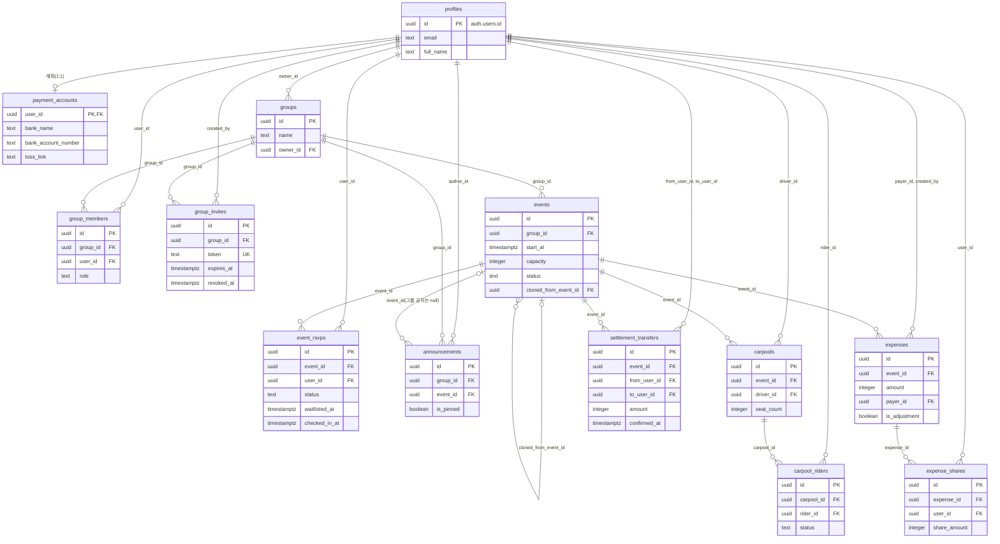

# DB 스키마 설계

모임 이벤트 관리 MVP의 전체 DB 설계 문서다. PRD "데이터 모델"과 "데이터 규칙 및 제약"(`docs/PRD.md`)을 테이블·제약·인덱스·함수·RLS 단위로 풀어 쓴다.

- **이 문서는 설계까지만 다룬다.** 마이그레이션·RLS·RPC 구현은 각 Phase의 DB Task(008·014·017·018·021·026)에서 이 문서를 기준으로 작성한다.
- 구현하다가 설계를 바꾸면 이 문서를 먼저 고치고, 같은 값을 쓰는 다른 곳도 함께 맞춘다.
  - 상태 값: `lib/types/domain.ts`
  - 길이·금액 상한: `lib/validations/*.ts`
  - 더미 데이터: `lib/mocks/*`
- "확정 필요"로 표시한 항목은 ROADMAP "결정 필요 사항"의 권장안을 기준으로 설계했다. 해당 Task 착수 전에 확정한다.

## 1. 공통 규칙

| 항목         | 규칙                                                                                                                                                                                      |
| ------------ | ----------------------------------------------------------------------------------------------------------------------------------------------------------------------------------------- |
| PK           | `id uuid primary key default gen_random_uuid()`. 예외: `payment_accounts`는 `user_id`가 PK                                                                                                |
| 시각         | `timestamptz`. 앱에서는 ISO 8601 문자열로 다룬다                                                                                                                                          |
| 금액         | `integer`, 원 단위. 부동소수점 금지                                                                                                                                                       |
| 상태 값      | `text` + CHECK. 값 목록은 `lib/types/domain.ts`의 `as const` 배열(`GROUP_ROLES` 등)과 같아야 한다. Postgres enum 타입은 값 추가·삭제가 번거로워서 쓰지 않는다                             |
| 타임스탬프   | 수정되는 테이블은 `created_at timestamptz not null default now()`, `updated_at timestamptz not null default now()`와 기존 `public.set_updated_at()` 트리거(`before update`)를 단다        |
| 함수         | `security definer` + `set search_path = ''`. 테이블·함수는 `public.`, 확장 함수는 `extensions.`처럼 스키마를 붙여 참조한다. 첫 줄에서 `auth.uid()`로 로그인·권한을 확인한다               |
| 함수 권한    | 모든 함수에 `revoke execute ... from public, anon, authenticated`를 먼저 적용한다. 그다음 클라이언트가 호출할 RPC만 `grant execute ... to authenticated`(초대 미리보기는 `anon`도)를 준다 |
| RPC 인자     | plpgsql에서 컬럼명과 충돌하지 않게 `p_` 접두를 붙인다(`p_group_id`). 이름은 Zod DTO 필드를 snake_case로 바꾼 것과 맞춘다(`groupId` → `p_group_id`)                                        |
| RLS          | 모든 테이블에 `enable row level security`. 정책 안의 `auth.uid()`는 `(select auth.uid())`로 감싸 행마다 다시 평가하지 않게 한다. 반복되는 판정은 헬퍼 함수(§6.1)로 뺀다                   |
| 동시성       | RSVP·대기자 승급·카풀 좌석·정산 재계산은 RLS로 직접 쓰기를 막고 RPC 안에서만 처리한다. 대상 `events`/`carpools` 행을 `select ... for update`로 잠근 뒤 검증하고 한 트랜잭션으로 반영한다  |
| 마이그레이션 | `supabase/migrations/<timestamp>_<설명>.sql` 파일로 남기고 같은 내용을 MCP `apply_migration`으로 반영한다. 그 뒤 `get_advisors` 확인 → `generate_typescript_types` 순서로 진행한다        |

## 2. ERD

profiles(기존) + PRD 신규 12개 테이블 = 13개 엔티티.

## 3. 테이블 정의

### 3.0 삭제 정책

- **그룹·이벤트 하위는 `on delete cascade`**: 그룹을 지우면 멤버·초대·이벤트·공지가 함께 지워진다. 이벤트를 지우면 RSVP·카풀·비용·송금이 함께 지워진다. `carpool_riders`는 carpools를, `expense_shares`는 expenses를 따라 지워진다.
- **`profiles`를 가리키는 FK는 `on delete restrict`**: 멤버 내보내기는 `group_members` 행만 삭제하고, 과거 RSVP·카풀·비용·정산 기록은 남긴다. 화면에서는 "나간 멤버"로 표기한다(PRD 접근 권한).
  - 계정 삭제(탈퇴)는 MVP 범위가 아니다. 나중에 지원할 때는 profiles를 익명화하는 방식으로 설계한다.
  - 예외: `payment_accounts`는 개인정보라 프로필과 함께 지운다(`cascade`).
- `events.cloned_from_event_id`는 `on delete set null`이다. 원본을 지워도 복제본은 남는다.
- MVP 화면에는 그룹 삭제 기능이 없다. cascade는 운영자가 정리할 때를 대비한 것이다.

> 표의 "추가"는 PRD 데이터 모델에 없는 컬럼이다. 화면 정렬·권한 판정에 쓰는 컬럼(`announcements.created_at`, `expenses.created_by`, `expenses.created_at`)은 도메인 타입(`lib/types/domain.ts`)에도 들어 있다. 감사용 `created_at`/`updated_at`은 도메인 타입에 없으며, 화면에서 필요해지면 repository 매퍼와 도메인 타입에 함께 추가한다.

### 3.1 profiles (기존, Task 001 이전부터 존재)

`supabase/migrations/20260926000000_create_profiles_table.sql`에서 이미 만들었다. 변경하지 않는다.

| 컬럼                   | 타입        | NULL | 기본값 | 비고                                       |
| ---------------------- | ----------- | ---- | ------ | ------------------------------------------ |
| id                     | uuid        | N    |        | PK, → `auth.users(id)` on delete cascade   |
| email                  | text        | Y    |        | `handle_user_email_update` 트리거로 동기화 |
| username               | text        | Y    |        | unique, 3~30자 CHECK. MVP UI 미노출        |
| full_name              | text        | Y    |        | 표시 이름                                  |
| avatar_url, bio        | text        | Y    |        | MVP UI 미노출                              |
| created_at, updated_at | timestamptz | N    | now()  | `profiles_set_updated_at` 트리거           |

- Task 027에서 `full_name` 길이 CHECK(`char_length(full_name) <= 30`, `FULL_NAME_MAX`)를 추가 마이그레이션으로 넣는다.

### 3.2 payment_accounts (Task 026)

| 컬럼                | 타입        | NULL | 기본값 | 비고                                   |
| ------------------- | ----------- | ---- | ------ | -------------------------------------- |
| user_id             | uuid        | N    |        | PK, → `profiles(id)` on delete cascade |
| bank_name           | text        | Y    |        | ≤ 30자                                 |
| bank_account_number | text        | Y    |        | ≤ 30자, 숫자·하이픈만                  |
| toss_link           | text        | Y    |        | ≤ 200자, `https://`로 시작             |
| created_at          | timestamptz | N    | now()  | 추가                                   |
| updated_at          | timestamptz | N    | now()  | `set_updated_at` 트리거                |

### 3.3 groups (Task 008)

| 컬럼        | 타입        | NULL | 기본값 | 비고                                                                        |
| ----------- | ----------- | ---- | ------ | --------------------------------------------------------------------------- |
| id          | uuid        | N    | gen    | PK                                                                          |
| name        | text        | N    |        | 1~50자                                                                      |
| description | text        | Y    |        | ≤ 500자                                                                     |
| owner_id    | uuid        | N    |        | → `profiles(id)` restrict. `change_member_role`로 owner를 넘길 때 함께 바뀜 |
| created_at  | timestamptz | N    | now()  |                                                                             |
| updated_at  | timestamptz | N    | now()  | 추가, 트리거                                                                |

### 3.4 group_members (Task 008)

| 컬럼      | 타입        | NULL | 기본값     | 비고                         |
| --------- | ----------- | ---- | ---------- | ---------------------------- |
| id        | uuid        | N    | gen        | PK                           |
| group_id  | uuid        | N    |            | → `groups(id)` cascade       |
| user_id   | uuid        | N    |            | → `profiles(id)` restrict    |
| role      | text        | N    | `'member'` | `owner` / `admin` / `member` |
| joined_at | timestamptz | N    | now()      |                              |

- 내보내기는 이 행만 지운다(hard delete). 이력 테이블은 profiles를 직접 참조하므로 영향이 없다.

### 3.5 group_invites (Task 008)

| 컬럼       | 타입        | NULL | 기본값  | 비고                                         |
| ---------- | ----------- | ---- | ------- | -------------------------------------------- |
| id         | uuid        | N    | gen     | PK                                           |
| group_id   | uuid        | N    |         | → `groups(id)` cascade                       |
| token      | text        | N    | 아래 식 | unique                                       |
| created_by | uuid        | N    |         | → `profiles(id)` restrict                    |
| expires_at | timestamptz | Y    |         | null이면 무기한. 만료 기간 **확정 필요**(D8) |
| revoked_at | timestamptz | Y    |         | 재발급으로 무효화된 시각                     |
| created_at | timestamptz | N    | now()   | 추가                                         |

- 토큰 기본값은 `translate(encode(extensions.gen_random_bytes(24), 'base64'), '+/', '-_')`다. 24바이트라서 패딩 없이 base64url 32자가 나온다. `INVITE_TOKEN_PATTERN`(`/^[A-Za-z0-9_-]{16,64}$/`, `lib/validations/invite.ts`)을 만족한다.
- "활성 초대"는 `revoked_at is null`인 행이다. 기한이 지났는지는 `expires_at`으로 따로 판정한다. 만료된 초대도 재발급 전까지는 활성 행으로 남는다.

### 3.6 events (Task 014)

| 컬럼                 | 타입        | NULL | 기본값        | 비고                                          |
| -------------------- | ----------- | ---- | ------------- | --------------------------------------------- |
| id                   | uuid        | N    | gen           | PK                                            |
| group_id             | uuid        | N    |               | → `groups(id)` cascade                        |
| title                | text        | N    |               | 1~100자                                       |
| description          | text        | Y    |               | ≤ 2000자                                      |
| location             | text        | Y    |               | ≤ 200자                                       |
| start_at             | timestamptz | N    |               |                                               |
| rsvp_deadline        | timestamptz | Y    |               | null이면 시작 전까지 응답 가능, `<= start_at` |
| capacity             | integer     | Y    |               | null이면 제한 없음, 1~1000                    |
| status               | text        | N    | `'scheduled'` | `scheduled`/`closed`/`completed`/`canceled`   |
| cloned_from_event_id | uuid        | Y    |               | → `events(id)` on delete set null             |
| created_at           | timestamptz | N    | now()         | 추가                                          |
| updated_at           | timestamptz | N    | now()         | 추가, 트리거                                  |

- 상태는 주최자가 수동으로만 바꾼다(자동 전환 없음). 정원을 늘리면 같은 트랜잭션에서 `promote_waitlist`를 호출한다(Task 015·017).

### 3.7 event_rsvps (Task 014)

| 컬럼          | 타입        | NULL | 기본값 | 비고                                                |
| ------------- | ----------- | ---- | ------ | --------------------------------------------------- |
| id            | uuid        | N    | gen    | PK                                                  |
| event_id      | uuid        | N    |        | → `events(id)` cascade                              |
| user_id       | uuid        | N    |        | → `profiles(id)` restrict                           |
| status        | text        | N    |        | `going`/`not_going`/`maybe`/`waitlisted`            |
| responded_at  | timestamptz | N    | now()  | 마지막 응답 시각                                    |
| waitlisted_at | timestamptz | Y    |        | `status = 'waitlisted'`일 때만 값이 있음, 승급 순서 |
| checked_in_at | timestamptz | Y    |        | 출석 체크. `going`일 때만 설정(RPC가 검증)          |

- `waitlisted`는 `respond_rsvp`만 정한다. 사용자 입력은 `USER_RSVP_STATUSES`(`lib/validations/rsvp.ts`)로 제한한다.

### 3.8 announcements (Task 014)

| 컬럼       | 타입        | NULL | 기본값 | 비고                                       |
| ---------- | ----------- | ---- | ------ | ------------------------------------------ |
| id         | uuid        | N    | gen    | PK                                         |
| group_id   | uuid        | N    |        | → `groups(id)` cascade                     |
| event_id   | uuid        | Y    |        | null이면 그룹 공지, → `events(id)` cascade |
| author_id  | uuid        | N    |        | → `profiles(id)` restrict                  |
| content    | text        | N    |        | 1~2000자, 텍스트로만 렌더                  |
| is_pinned  | boolean     | N    | false  |                                            |
| created_at | timestamptz | N    | now()  | 추가. 정렬 기준(고정 우선 → 최신순)        |
| updated_at | timestamptz | N    | now()  | 추가, 트리거                               |

- 이벤트 공지의 `group_id`는 그 이벤트의 그룹과 같아야 한다. insert/update 정책의 `with check`에서 `exists (select 1 from public.events e where e.id = event_id and e.group_id = group_id)`로 검증한다.

### 3.9 carpools (Task 021)

| 컬럼            | 타입        | NULL | 기본값 | 비고                                     |
| --------------- | ----------- | ---- | ------ | ---------------------------------------- |
| id              | uuid        | N    | gen    | PK                                       |
| event_id        | uuid        | N    |        | → `events(id)` cascade                   |
| driver_id       | uuid        | N    |        | → `profiles(id)` restrict                |
| departure_point | text        | N    |        | 1~100자                                  |
| departure_time  | timestamptz | N    |        |                                          |
| seat_count      | integer     | N    |        | 1~10. 신청 중 탑승자 수 미만으로 못 줄임 |
| created_at      | timestamptz | N    | now()  | 추가                                     |
| updated_at      | timestamptz | N    | now()  | 추가, 트리거                             |

### 3.10 carpool_riders (Task 021)

| 컬럼         | 타입        | NULL | 기본값        | 비고                      |
| ------------ | ----------- | ---- | ------------- | ------------------------- |
| id           | uuid        | N    | gen           | PK                        |
| carpool_id   | uuid        | N    |               | → `carpools(id)` cascade  |
| rider_id     | uuid        | N    |               | → `profiles(id)` restrict |
| status       | text        | N    | `'requested'` | `requested` / `canceled`  |
| requested_at | timestamptz | N    | now()         |                           |

- 취소해도 행을 지우지 않고 `canceled`로 남긴다. 다시 신청하면 새 행을 만든다. 신청 중 행은 부분 유니크라서 하나뿐이다.

### 3.11 expenses (Task 026)

| 컬럼          | 타입        | NULL | 기본값 | 비고                                                     |
| ------------- | ----------- | ---- | ------ | -------------------------------------------------------- |
| id            | uuid        | N    | gen    | PK                                                       |
| event_id      | uuid        | N    |        | → `events(id)` cascade                                   |
| name          | text        | N    |        | 1~100자                                                  |
| amount        | integer     | N    |        | 일반 항목 ≥ 0, 조정 항목 ≠ 0, \|amount\| ≤ 10,000,000    |
| payer_id      | uuid        | N    |        | → `profiles(id)` restrict                                |
| is_adjustment | boolean     | N    | false  |                                                          |
| created_by    | uuid        | N    |        | 추가. 수정·삭제 권한 판정(D6), → `profiles(id)` restrict |
| created_at    | timestamptz | N    | now()  | 추가. 목록 정렬                                          |
| updated_at    | timestamptz | N    | now()  | 추가, 트리거                                             |

### 3.12 expense_shares (Task 026)

| 컬럼         | 타입    | NULL | 기본값 | 비고                      |
| ------------ | ------- | ---- | ------ | ------------------------- |
| id           | uuid    | N    | gen    | PK                        |
| expense_id   | uuid    | N    |        | → `expenses(id)` cascade  |
| user_id      | uuid    | N    |        | → `profiles(id)` restrict |
| share_amount | integer | N    |        | 조정 항목이면 음수 가능   |

- 결제자도 분담자에 포함될 수 있다. 결제자 몫은 금액에서 나머지를 뺀 값이다. 분담액 합계가 `expenses.amount`와 같아야 한다는 규칙은 행 하나로 검사할 수 없어서 CHECK 대신 `save_expense`가 보장한다.
  - 예: 10,000원을 3명이 나누면 타인 3,333원씩, 결제자 3,334원
- 분배 규칙은 `lib/settlement/split.ts`(Task 025)와 같다. 음수 금액 분배는 **확정 필요**(D5)다.

### 3.13 settlement_transfers (Task 026)

| 컬럼               | 타입        | NULL | 기본값 | 비고                                           |
| ------------------ | ----------- | ---- | ------ | ---------------------------------------------- |
| id                 | uuid        | N    | gen    | PK                                             |
| event_id           | uuid        | N    |        | → `events(id)` cascade                         |
| from_user_id       | uuid        | N    |        | 송금자, → `profiles(id)` restrict              |
| to_user_id         | uuid        | N    |        | 받는 사람(결제자), → `profiles(id)` restrict   |
| amount             | integer     | N    |        | 상계 후 순 금액, > 0                           |
| transfer_marked_at | timestamptz | Y    |        | 송금 완료 표시. 금액이 바뀌면 재계산 때 초기화 |
| confirmed_at       | timestamptz | Y    |        | 입금 확인. 하나라도 있으면 이벤트 정산 잠금    |
| created_at         | timestamptz | N    | now()  | 추가                                           |
| updated_at         | timestamptz | N    | now()  | 추가, 트리거                                   |

- `recalculate_settlement`만 이 테이블을 쓴다. 0원이 된 쌍은 행을 지운다. 단, 입금 확인된 행은 지우거나 금액을 바꾸지 않는다.

## 4. 제약

### 4.1 CHECK

| 테이블               | 제약 이름                          | 정의                                                                                           | 출처                                 |
| -------------------- | ---------------------------------- | ---------------------------------------------------------------------------------------------- | ------------------------------------ |
| group_members        | group_members_role_check           | `role in ('owner', 'admin', 'member')`                                                         | PRD, `GROUP_ROLES`                   |
| events               | events_status_check                | `status in ('scheduled', 'closed', 'completed', 'canceled')`                                   | PRD, `EVENT_STATUSES`                |
| events               | events_capacity_check              | `capacity is null or capacity between 1 and 1000`                                              | PRD, `EVENT_CAPACITY_MAX`            |
| events               | events_deadline_check              | `rsvp_deadline is null or rsvp_deadline <= start_at`                                           | ROADMAP 015                          |
| event_rsvps          | event_rsvps_status_check           | `status in ('going', 'not_going', 'maybe', 'waitlisted')`                                      | PRD, `RSVP_STATUSES`                 |
| event_rsvps          | event_rsvps_waitlist_check         | `(status = 'waitlisted') = (waitlisted_at is not null)`                                        | 승급 순서 무결성                     |
| carpool_riders       | carpool_riders_status_check        | `status in ('requested', 'canceled')`                                                          | PRD, `CARPOOL_RIDER_STATUSES`        |
| carpools             | carpools_seat_count_check          | `seat_count between 1 and 10`                                                                  | PRD, `SEAT_COUNT_MAX`                |
| expenses             | expenses_amount_check              | `is_adjustment or amount >= 0`                                                                 | PRD                                  |
| expenses             | expenses_adjustment_nonzero_check  | `not is_adjustment or amount <> 0`                                                             | Zod `isValidAmount`                  |
| expenses             | expenses_amount_range_check        | `amount between -10000000 and 10000000`                                                        | `AMOUNT_MAX`                         |
| settlement_transfers | settlement_transfers_amount_check  | `amount > 0`                                                                                   | 0원 행 제거 규칙                     |
| settlement_transfers | settlement_transfers_self_check    | `from_user_id <> to_user_id`                                                                   | PRD 정산 규칙 2                      |
| settlement_transfers | settlement_transfers_confirm_check | `confirmed_at is null or transfer_marked_at is not null`                                       | 송금 표시 → 입금 확인 순서           |
| payment_accounts     | payment_accounts_account_check     | `bank_account_number is null or bank_account_number ~ '^[0-9-]+$'`                             | `lib/validations/payment-account.ts` |
| payment_accounts     | payment_accounts_toss_check        | `toss_link is null or toss_link like 'https://%'`. 허용 호스트는 Zod(`TOSS_LINK_HOSTS`)가 검증 | Task 027                             |

**문자열 길이 CHECK** (`char_length(...)`, 상한은 Zod 상수와 같다)

| 테이블.컬럼                          | 범위   | Zod 상수                   |
| ------------------------------------ | ------ | -------------------------- |
| groups.name                          | 1~50   | `GROUP_NAME_MAX`           |
| groups.description                   | ≤ 500  | `GROUP_DESCRIPTION_MAX`    |
| events.title                         | 1~100  | `EVENT_TITLE_MAX`          |
| events.location                      | ≤ 200  | `EVENT_LOCATION_MAX`       |
| events.description                   | ≤ 2000 | `EVENT_DESCRIPTION_MAX`    |
| announcements.content                | 1~2000 | `ANNOUNCEMENT_CONTENT_MAX` |
| carpools.departure_point             | 1~100  | `DEPARTURE_POINT_MAX`      |
| expenses.name                        | 1~100  | `EXPENSE_NAME_MAX`         |
| payment_accounts.bank_name           | ≤ 30   | `BANK_NAME_MAX`            |
| payment_accounts.bank_account_number | ≤ 30   | `BANK_ACCOUNT_NUMBER_MAX`  |
| payment_accounts.toss_link           | ≤ 200  | `TOSS_LINK_MAX`            |
| profiles.full_name (Task 027)        | ≤ 30   | `FULL_NAME_MAX`            |

필수 텍스트의 하한 1자는 Zod가 공백을 지운 뒤 검사한다. DB에서는 `char_length(trim(x)) >= 1`로 검사한다.

### 4.2 UNIQUE

| 테이블               | 제약/인덱스 이름                    | 정의                                                       | 종류               | 출처    |
| -------------------- | ----------------------------------- | ---------------------------------------------------------- | ------------------ | ------- |
| group_members        | group_members_group_user_key        | `unique (group_id, user_id)`                               | 제약               | PRD     |
| event_rsvps          | event_rsvps_event_user_key          | `unique (event_id, user_id)`                               | 제약               | PRD     |
| expense_shares       | expense_shares_expense_user_key     | `unique (expense_id, user_id)`                             | 제약               | PRD     |
| carpool_riders       | carpool_riders_active_key           | `unique (carpool_id, rider_id) where status = 'requested'` | 부분 유니크 인덱스 | PRD     |
| carpools             | carpools_event_driver_key           | `unique (event_id, driver_id)`                             | 제약               | PRD     |
| group_invites        | group_invites_active_key            | `unique (group_id) where revoked_at is null`               | 부분 유니크 인덱스 | PRD     |
| group_invites        | group_invites_token_key             | `unique (token)`                                           | 제약               | PRD     |
| settlement_transfers | settlement_transfers_event_pair_key | `unique (event_id, from_user_id, to_user_id)`              | 제약               | PRD     |
| payment_accounts     | (PK)                                | `primary key (user_id)`                                    | PK                 | PRD 1:1 |

- 부분 유니크는 `create unique index ... where ...`로 만든다(테이블 제약으로는 불가).
- 한 이벤트에서 카풀 여러 개에 동시에 탑승하는 것을 막는 규칙은 rider·event 조합이라 유니크 인덱스로 표현할 수 없다. `request_carpool_seat`에서 검증한다. **확정 필요**(D3).

## 5. 인덱스

유니크 제약은 자동으로 인덱스를 만들므로 따로 만들지 않는다.

| 인덱스                                                                     | 목적                                                 | Task |
| -------------------------------------------------------------------------- | ---------------------------------------------------- | ---- |
| `group_members_group_user_key` (유니크 재사용)                             | `is_group_member`/`is_group_admin`, 그룹별 멤버 목록 | 008  |
| `group_members (user_id)`                                                  | 대시보드 "내 그룹" 조회, FK                          | 008  |
| `groups (owner_id)`                                                        | FK                                                   | 008  |
| `group_invites (created_by)`                                               | FK                                                   | 008  |
| `events (group_id, start_at)`                                              | 그룹 홈 이벤트 목록, 대시보드 다음 이벤트, FK        | 014  |
| `events (cloned_from_event_id)`                                            | FK(set null 처리)                                    | 014  |
| `event_rsvps_event_user_key` (유니크 재사용)                               | 내 응답 조회, `is_event_attendee`                    | 014  |
| `event_rsvps (event_id, waitlisted_at) where status = 'waitlisted'`        | 대기열 선착순 승급                                   | 014  |
| `event_rsvps (user_id)`                                                    | FK                                                   | 014  |
| `announcements (group_id, is_pinned desc, created_at desc)`                | 그룹/이벤트 공지 정렬, FK                            | 014  |
| `announcements (event_id)`                                                 | 이벤트 공지, FK                                      | 014  |
| `announcements (author_id)`                                                | FK                                                   | 014  |
| `carpools_event_driver_key` (유니크 재사용)                                | 이벤트별 카풀 목록                                   | 021  |
| `carpools (driver_id)`                                                     | FK                                                   | 021  |
| `carpool_riders (carpool_id) where status = 'requested'`                   | 잔여 좌석 계산                                       | 021  |
| `carpool_riders (rider_id)`                                                | FK, 이벤트당 1카풀 검증                              | 021  |
| `expenses (event_id, created_at)`                                          | 항목 목록, FK                                        | 026  |
| `expenses (payer_id)`, `expenses (created_by)`                             | FK                                                   | 026  |
| `expense_shares_expense_user_key` (유니크 재사용)                          | 항목별 분담                                          | 026  |
| `expense_shares (user_id)`                                                 | FK                                                   | 026  |
| `settlement_transfers_event_pair_key` (유니크 재사용)                      | 이벤트별 요약, 잠금 판정                             | 026  |
| `settlement_transfers (from_user_id)`, `settlement_transfers (to_user_id)` | 내 송금/받을 돈, `get_payee_accounts`, FK            | 026  |

- 각 DB Task 마무리에 `get_advisors`(performance)로 `unindexed_foreign_keys` 경고가 0건인지 확인한다.

## 6. 함수·RPC

### 6.1 RLS 헬퍼 (stable, security definer)

RLS 정책 안에서 다른 테이블을 조회할 때 재귀를 피하고 재사용하기 위한 함수다. `security definer`라서 RLS를 거치지 않으므로 반환은 boolean만 한다. 정책에서 쓰려면 `authenticated`에 실행 권한이 필요하다.

| 함수                                 | 반환    | 판정                                                                           | grant         | Task |
| ------------------------------------ | ------- | ------------------------------------------------------------------------------ | ------------- | ---- |
| `is_group_member(p_group_id uuid)`   | boolean | `group_members`에 `(p_group_id, auth.uid())` 행이 있음                         | authenticated | 008  |
| `is_group_admin(p_group_id uuid)`    | boolean | 위 행의 `role in ('owner', 'admin')`                                           | authenticated | 008  |
| `is_event_member(p_event_id uuid)`   | boolean | 이벤트의 `group_id`로 `is_group_member`                                        | authenticated | 014  |
| `is_event_admin(p_event_id uuid)`    | boolean | 이벤트의 `group_id`로 `is_group_admin` (이벤트 하위 테이블 정책용, 추가)       | authenticated | 014  |
| `is_event_attendee(p_event_id uuid)` | boolean | `event_rsvps`에 `(p_event_id, auth.uid(), 'going')` 행이 있고 현재 그룹 멤버임 | authenticated | 014  |

### 6.2 클라이언트 RPC

모두 `security definer`, `set search_path = ''`, `volatile`이다. 첫 줄에서 `auth.uid()`가 null이면 `UNAUTHENTICATED` 에러를 낸다(초대 미리보기는 예외). grant는 따로 적지 않았으면 `authenticated`에만 준다.

| 함수(시그니처)                                                                                                                                   | 반환                                                                             | 잠금 행                    | 검증·처리                                                                                                                                                                                                | Task    |
| ------------------------------------------------------------------------------------------------------------------------------------------------ | -------------------------------------------------------------------------------- | -------------------------- | -------------------------------------------------------------------------------------------------------------------------------------------------------------------------------------------------------- | ------- |
| `create_group(p_name text, p_description text)`                                                                                                  | `uuid`(group id)                                                                 | -                          | groups + owner 멤버 행 + 첫 초대를 한 트랜잭션으로 생성                                                                                                                                                  | 008     |
| `get_invite_preview(p_token text)` · **anon 허용**, `stable`                                                                                     | `table(group_name text, group_description text, status text, is_member boolean)` | -                          | status는 `valid`/`expired`/`invalid`. 무효·만료면 그룹 정보는 null. 그 외 컬럼(id, owner 등)은 반환하지 않음. 비로그인은 `is_member = false`                                                             | 008     |
| `accept_invite(p_token text)`                                                                                                                    | `uuid`(group id)                                                                 | -                          | 무효·만료 → `INVALID_INVITE`. 이미 멤버면 아무것도 하지 않고 group id를 반환(`on conflict do nothing`)                                                                                                   | 008     |
| `regenerate_invite(p_group_id uuid)`                                                                                                             | `text`(새 token)                                                                 | 그룹의 활성 초대           | admin 이상. 기존 활성 행에 `revoked_at = now()`를 기록하고 새 행을 insert                                                                                                                                | 008     |
| `change_member_role(p_group_id uuid, p_user_id uuid, p_role text)`                                                                               | `void`                                                                           | `groups` 행                | admin 이상. admin은 owner를 바꾸거나 owner로 올릴 수 없음. 마지막 owner는 강등 불가. owner를 넘기면 `groups.owner_id`를 동기화                                                                           | 008     |
| `remove_member(p_group_id uuid, p_user_id uuid)`                                                                                                 | `void`                                                                           | `groups` 행                | admin 이상, 마지막 owner 불가, admin은 owner 불가. `group_members` 행만 삭제. 미래 이벤트 RSVP 정리 + 승급은 **확정 필요**(D1)                                                                           | 008·011 |
| `respond_rsvp(p_event_id uuid, p_status text)`                                                                                                   | `text`(결과 status)                                                              | `events` 행 `for update`   | 멤버, `status = 'scheduled'`, 마감 전, `p_status in ('going', 'not_going', 'maybe')`. `going`인데 정원이 찼으면 `waitlisted` + `waitlisted_at = now()`. `going`에서 바뀌면 `promote_waitlist` 호출       | 017     |
| `set_check_in(p_event_id uuid, p_user_id uuid, p_checked boolean)`                                                                               | `void`                                                                           | -                          | admin 이상, 대상이 `going`일 때만 `checked_in_at` 설정/해제                                                                                                                                              | 018     |
| `request_carpool_seat(p_carpool_id uuid)`                                                                                                        | `void`                                                                           | `carpools` 행 `for update` | 참석 확정자, 운전자 본인 아님, 잔여 좌석 > 0 → 아니면 `CAPACITY_FULL`. 같은 이벤트의 다른 카풀에 신청 중이면 `CONFLICT`(D3). 중복 신청은 부분 유니크로 차단                                              | 021     |
| `cancel_carpool_seat(p_carpool_id uuid)`                                                                                                         | `void`                                                                           | `carpools` 행 `for update` | 본인의 `requested` 행을 `canceled`로                                                                                                                                                                     | 021     |
| `get_payee_accounts(p_event_id uuid)` · `stable`                                                                                                 | `table(user_id uuid, bank_name text, bank_account_number text, toss_link text)`  | -                          | 참석자. `settlement_transfers`에서 `from_user_id = auth.uid()`인 행의 `to_user_id` 계좌만 반환                                                                                                           | 026     |
| `save_expense(p_event_id uuid, p_expense_id uuid, p_name text, p_amount integer, p_payer_id uuid, p_sharer_ids uuid[], p_is_adjustment boolean)` | `uuid`(expense id)                                                               | `events` 행 `for update`   | `p_expense_id`가 null이면 생성, 아니면 수정. 참석자, 결제자·분담자가 `going` 응답자. 확인된 송금이 있으면 수정 → `LOCKED`, 조정 항목 추가만 허용. 분담액 계산 → shares 재작성 → `recalculate_settlement` | 026     |
| `delete_expense(p_expense_id uuid)`                                                                                                              | `void`                                                                           | `events` 행 `for update`   | 잠금이면 `LOCKED`. 권한 범위 **확정 필요**(D6). 삭제 후 `recalculate_settlement`                                                                                                                         | 026     |
| `mark_transfer_sent(p_transfer_id uuid)`                                                                                                         | `void`                                                                           | 해당 transfer 행           | `from_user_id = auth.uid()`만 가능. `transfer_marked_at = now()`                                                                                                                                         | 026     |
| `confirm_transfer(p_transfer_id uuid)`                                                                                                           | `void`                                                                           | 해당 transfer 행           | `to_user_id = auth.uid()`만 가능. 송금 표시가 먼저 있어야 함. `confirmed_at = now()`. 확인 취소는 **확정 필요**(D7)                                                                                      | 026     |

- 그룹 수정, 이벤트·공지 생성/수정/삭제, 카풀 등록/수정/삭제, 계좌 upsert는 RPC 없이 RLS 정책(§7)으로 처리한다.
- 비용 등록 화면의 `CreateExpenseInput`/`UpdateExpenseInput`(`lib/validations/expense.ts`)은 `save_expense` 하나로 들어간다. `createExpense`는 `p_expense_id = null`로 호출한다.

### 6.3 내부 함수·트리거 (클라이언트 실행 권한 revoke)

| 함수                                      | 호출처                                 | 처리                                                                                                                                                                                    | Task |
| ----------------------------------------- | -------------------------------------- | --------------------------------------------------------------------------------------------------------------------------------------------------------------------------------------- | ---- |
| `promote_waitlist(p_event_id uuid)`       | `respond_rsvp`, 정원 변경 트리거       | 호출자가 이미 `events` 행을 잠근 상태를 전제한다. 빈자리만큼 `waitlisted_at` 오름차순으로 `going`으로 바꾸고 `waitlisted_at`을 null로 만든다. 정원 축소로 초과된 경우 강등하지 않음(D2) | 017  |
| `events_capacity_changed()` 트리거        | `events` after update of capacity      | 정원이 늘면 `promote_waitlist` 호출                                                                                                                                                     | 017  |
| `carpools_check_seat_count()` 트리거      | `carpools` before update of seat_count | 신청 중 탑승자 수보다 작게 줄이면 에러(`CONFLICT`)                                                                                                                                      | 021  |
| `recalculate_settlement(p_event_id uuid)` | `save_expense`, `delete_expense`       | Task 025 규칙대로 쌍별 합산 → 상계 → upsert. 금액이 바뀐 행은 `transfer_marked_at`을 초기화. 0원 행은 삭제. 확인된 행은 유지                                                            | 026  |
| `set_updated_at()` (기존)                 | 각 테이블 `before update`              | `updated_at = now()`                                                                                                                                                                    | -    |

### 6.4 RPC 에러 → ActionResult 매핑

RPC는 `raise exception '<CODE>: <메시지>' using errcode = 'P0001'`로 실패를 알린다. repository가 메시지 앞의 코드를 파싱해서 `ActionErrorCode`(`lib/types/action-result.ts`)로 바꾼다. 제약 위반은 Postgres 표준 SQLSTATE로 매핑한다.

| 상황                               | 발생 위치                          | ActionErrorCode   |
| ---------------------------------- | ---------------------------------- | ----------------- |
| `auth.uid()` 없음                  | 모든 RPC                           | `UNAUTHENTICATED` |
| 비멤버·비관리자·비참석자·본인 아님 | RPC 권한 확인, RLS 거부(`42501`)   | `FORBIDDEN`       |
| 대상 행 없음                       | RPC                                | `NOT_FOUND`       |
| 유니크 위반(`23505`), 상태 충돌    | 중복 신청, 마지막 owner, 좌석 축소 | `CONFLICT`        |
| 정원·좌석 초과                     | `request_carpool_seat`             | `CAPACITY_FULL`   |
| 입금 확인 후 수정·삭제             | `save_expense`, `delete_expense`   | `LOCKED`          |
| 토큰 무효·만료                     | `accept_invite`                    | `INVALID_INVITE`  |
| CHECK 위반(`23514`)                | 입력 검증 누락                     | `VALIDATION`      |
| 그 외                              | -                                  | `INTERNAL`        |

- 정원 초과는 RSVP에서 에러가 아니다. `respond_rsvp`가 `waitlisted`를 반환하면 화면은 "대기 N번"을 안내한다.

## 7. RLS 매트릭스

표기: **본인**은 `auth.uid()`가 해당 사용자 컬럼과 같음, **멤버**/**admin**은 §6.1 헬퍼 판정, **참석자**는 `is_event_attendee`, **RPC**는 정책 없음(직접 쓰기 거부, security definer RPC만 씀), **-**는 정책 없음(거부).

| 테이블               | select                             | insert                      | update                                     | delete       |
| -------------------- | ---------------------------------- | --------------------------- | ------------------------------------------ | ------------ |
| profiles (기존)      | 로그인 사용자 전체(`using (true)`) | 본인                        | 본인                                       | -            |
| payment_accounts     | 본인 (타인은 `get_payee_accounts`) | 본인                        | 본인                                       | 본인         |
| groups               | 멤버                               | RPC(`create_group`)         | admin (`owner_id` 변경은 RPC만, 아래 참고) | -            |
| group_members        | 같은 그룹 멤버                     | RPC                         | RPC                                        | RPC          |
| group_invites        | admin (비로그인 미리보기는 RPC)    | RPC                         | RPC                                        | -            |
| events               | 멤버                               | admin                       | admin                                      | admin        |
| event_rsvps          | 멤버                               | RPC                         | RPC                                        | -            |
| announcements        | 멤버                               | admin (`author_id` = 본인)  | admin                                      | admin        |
| carpools             | 참석자                             | 참석자 + `driver_id` = 본인 | 본인(운전자)                               | 본인(운전자) |
| carpool_riders       | 참석자(카풀의 이벤트 기준)         | RPC                         | RPC                                        | -            |
| expenses             | 참석자                             | RPC                         | RPC                                        | RPC          |
| expense_shares       | 참석자(비용의 이벤트 기준)         | RPC                         | RPC                                        | RPC          |
| settlement_transfers | 참석자                             | RPC                         | RPC                                        | RPC          |

- `groups` update에서 `owner_id`를 바꾸지 못하게 컬럼 권한으로 막는다. 방법: `revoke update on public.groups from authenticated` 후 `grant update (name, description) on public.groups to authenticated`. owner 위임은 `change_member_role`만 처리한다.
- events·announcements의 `group_id`, carpools의 `event_id`·`driver_id`도 같은 방식으로 update 대상 컬럼을 제한해서 다른 그룹·이벤트로 옮기지 못하게 한다.
- 나간 멤버의 이름 표시는 `profiles` 전체 조회 정책으로 가능하다. 표시 문구는 앱에서 정한다(`lib/services/member-display.ts`, Task 011).

## 8. 결정 필요 사항과 설계 영향

ROADMAP "결정 필요 사항"을 참조만 한다. 이 문서는 권장안 기준으로 설계했다.

| #   | 주제                                   | 권장안(이 문서 기준)                                  | 영향받는 곳                                             | 확정 시점 |
| --- | -------------------------------------- | ----------------------------------------------------- | ------------------------------------------------------- | --------- |
| D1  | 멤버 내보내기와 미래 이벤트 RSVP       | 미래 `scheduled` 이벤트 응답을 `not_going`으로 + 승급 | `remove_member`, `promote_waitlist`                     | Task 011  |
| D2  | 정원 축소 시 초과 참석자               | 강등하지 않고 승급만 멈춤                             | `promote_waitlist`, `events_capacity_changed`           | Task 017  |
| D3  | 한 이벤트 여러 카풀 동시 탑승          | 이벤트당 1개만(RPC에서 검증)                          | `request_carpool_seat`                                  | Task 021  |
| D4  | RSVP 변경 시 카풀                      | 운전자 불참 → 카풀 삭제, 탑승자 불참 → 자동 취소      | `respond_rsvp`(카풀 정리 추가 여부)                     | Task 022  |
| D5  | 조정 항목(음수) 분배                   | 절댓값으로 나눈 뒤 부호를 붙임, 나머지는 결제자       | `save_expense`, `lib/settlement/split.ts`               | Task 025  |
| D6  | 비용 등록·수정 권한                    | 등록은 참석자 누구나, 수정·삭제는 등록자·결제자·admin | `save_expense`, `delete_expense`, `expenses.created_by` | Task 026  |
| D7  | 입금 확인 취소                         | 받는 사람이 취소 가능, 취소 시 잠금 재평가            | `confirm_transfer`(취소 RPC 추가 여부)                  | Task 029  |
| D8  | 초대 링크 만료 기간 (이 문서에서 추가) | 무기한(`expires_at = null`), 재발급으로만 무효화      | `create_group`, `regenerate_invite`                     | Task 008  |

## 9. PRD 매핑 체크리스트

### 9.1 신규 테이블 (12개)

- [x] `payment_accounts` → §3.2
- [x] `groups` → §3.3
- [x] `group_members` → §3.4
- [x] `group_invites` → §3.5
- [x] `events` → §3.6
- [x] `event_rsvps` → §3.7
- [x] `announcements` → §3.8
- [x] `carpools` → §3.9
- [x] `carpool_riders` → §3.10
- [x] `expenses` → §3.11
- [x] `expense_shares` → §3.12
- [x] `settlement_transfers` → §3.13

### 9.2 값 제약 (PRD "값 제약 (CHECK)")

- [x] `group_members.role` owner/admin/member → §4.1 `group_members_role_check`
- [x] `events.status` scheduled/closed/completed/canceled → §4.1 `events_status_check`
- [x] `event_rsvps.status` going/not_going/maybe/waitlisted → §4.1 `event_rsvps_status_check`
- [x] `carpool_riders.status` requested/canceled → §4.1 `carpool_riders_status_check`
- [x] 금액은 원 단위 정수 → §1(integer), §3.11·§3.12·§3.13
- [x] 일반 항목 0 이상, 조정 항목만 음수 → §4.1 `expenses_amount_check`
- [x] `seat_count` 1 이상 → §4.1 `carpools_seat_count_check`
- [x] `capacity` 1 이상(NULL 허용) → §4.1 `events_capacity_check`

### 9.3 유니크 제약 (PRD "유니크 제약")

- [x] `group_members(group_id, user_id)` → §4.2
- [x] `event_rsvps(event_id, user_id)` → §4.2
- [x] `expense_shares(expense_id, user_id)` → §4.2
- [x] `carpool_riders(carpool_id, rider_id) where status = 'requested'` → §4.2 부분 유니크
- [x] `carpools(event_id, driver_id)` → §4.2
- [x] `group_invites(group_id) where revoked_at is null` → §4.2 부분 유니크
- [x] `group_invites(token)` → §4.2
- [x] `settlement_transfers(event_id, from_user_id, to_user_id)` → §4.2

### 9.4 동시성·정산·접근 권한

- [x] RSVP·승급·카풀 신청은 `for update` 잠금 RPC → §6.2 `respond_rsvp`, `request_carpool_seat`, §6.3 `promote_waitlist`
- [x] 대기자 승급은 `waitlisted_at` 오름차순 → §5 대기열 인덱스, §6.3
- [x] 정산 규칙 1~5 → §3.12, §3.13, §6.2 `save_expense`, §6.3 `recalculate_settlement`
- [x] `is_group_member`·`is_group_admin` 헬퍼 → §6.1
- [x] 카풀·정산은 `going` 응답자만 → §6.1 `is_event_attendee`, §7
- [x] 비로그인 초대 미리보기 RPC `get_invite_preview` → §6.2
- [x] 계좌는 별도 테이블 + 필요한 컬럼만 반환하는 RPC → §3.2, §6.2 `get_payee_accounts`, §7
- [x] 내보내기 후 이력 보존("나간 멤버") → §3.0, §3.4

### 9.5 ROADMAP 함수 목록

- [x] Task 008: `is_group_member`, `is_group_admin`, `create_group`, `get_invite_preview`, `accept_invite`, `regenerate_invite`, `change_member_role`, `remove_member`
- [x] Task 014: `is_event_member`, `is_event_attendee`
- [x] Task 017: `respond_rsvp`, `promote_waitlist`
- [x] Task 018: `set_check_in`
- [x] Task 021: `request_carpool_seat`, `cancel_carpool_seat`, 좌석 축소 검증(`carpools_check_seat_count`)
- [x] Task 026: `get_payee_accounts`, `save_expense`, `delete_expense`, `recalculate_settlement`, `mark_transfer_sent`, `confirm_transfer`
